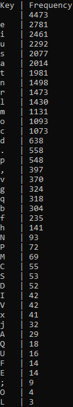
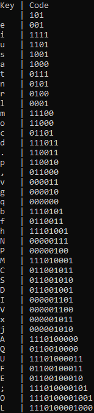

# Лабораторная работа №2: Создание архиватора
## Описание работы
### Цели
1.	Отработать на практике работу с файлами.
2.	Научиться реализовывать консольную утилиту средствами .NET. 

### Задание
Написать программу-архиватор, выполняющую сжатие/извлечение указанного ей файла. 

Формат сжимаемых данных и алгоритм сжатия остаётся на усмотрение студента: допускается применение любых алгоритмов и форматов (в том числе можно придумать свой). Нельзя использовать готовые библиотеки для сжатия данных. 
Программа должна быть реализована в виде консольного приложения, получающего три параметра из командной строки: 
-   Признак действия с файлом (сжатие/извлечение). 
-	Название исходного файла;
-	Название целевого файла; 

Программа должна прочитать исходный файл и в зависимости от признака действия сжать файл или распаковать его, сохранив результат на диске в целевом файле. 

Пример строки запуска (запуск из командной консоли Windows, программа должна распаковать файл archive.bin, ранее созданный этой же утилитой, в textfile.txt):

*Packer.exe –unpack archive.bin textfile.txt* 

Выполнение перечисленных выше требований оценивается как «удовлетворительно». Для получения более высоких оценок необходимо дополнительно:
-   Для получения оценки «Хорошо»  выполнить все следующие требования: 
    -   отображать время работы программы в секундах и коэффициент сжатия при выполнении сжатия (отношение размера упакованного файла к исходному);
    -   добавить параметр командной строки  “test” в программу, при указании которого она будет формировать случайный тестовый файл, на котором можно проверить сжатие. Размер файла (можно примерный размер, а не точный) должен задаваться вторым байтом. Пример вызова:
  
*Packer.exe –testfile.txt 100000* 

-   Для получения оценки «Отлично» необходимо к требованиям оценки «хорошо» выполнить следующее требование:
    -	программа должна сжимать файл размером 100 Мб не дольше 50 секунд на студенческом компьютере в лаборатории.

### Демонстрация работы
1.	Рассказать коротко используемые алгоритмы сжатия и извлечения.
2.	Подготовить два файла: хорошо сжимаемый разработанным архиватором, и плохо сжимаемый. Пояснить, почему один из файлов сжимается хорошо, а другой плохо.
3.	Сжать оба файла. Размер одного из архивов должен оказаться меньше размера исходного файла.
4.	Извлечь оба файла из архива. Должны получиться исходные файлы.
5.	Для проверки на оценку отлично необходимо подготовить тестовый файл размером не менее 100 Мб и сжать его.

## Выполнение работы
### Описание алгоритма
Я реализовал Кодирование Хаффмана. <br>
Суть данного метода заключается в том, что часто встречаемые символы мы кодируем меньшим количеством бит, и наоборот. Таким образом, мы можем уменьшить общее количество бит для хранения файла. 

Этот метод кодирования состоит из двух основных этапов:
1.  Построение оптимального кодового дерева.
2.  Построение отображения код-символ на основе построенного дерева.

Для построения кодового дерева нам нужно сначала проанализировать файл и определить какие символы появляются чаще, а какие реже. Для этого мы можем пройтись по файлу и посчитать частоту появления каждого символа.

Получаем таблицу частот символов.

| Символ  | А  | Б | В | Г | Д |
| ------- | -- | - | - | - | - |
| Частота | 15 | 7 | 6 | 6 | 5 |

Далее строится бинарное дерево. Символы из алфавита образуют список свободных узлов. Каждый лист имеет вес, который равен частоте данного символа. Выбираются два узла с наименьшим весом. Для них создаётся родительский узел с весом, равным их суммарному весу. Родитель добавляется в список свободных узлов, а два его потомка удаляются из этого списка. Одной дуге ставится в соответствие бит 1, другой — бит 0. Алгоритм повторяется пока не останется один свободный узел.


Пройдя путь от листа дерева, соответствующего текущему символу, до его корня, накапливая биты при перемещении по ветвям дерева мы получик код, которым будем кодировать данный символ.

Получается таблица кодов Хаффмана.

| Символ  | А |  Б  |  В  |  Г  |  Д  |
| ------- | - | --- | --- | --- | --- |
| Частота | 0 | 100 | 101 | 110 | 111 |

Кодируя файл по данной таблице мы получим сжатый файл.

Созданное дерево мы поместим в начале файла, чтобы программа знала как раскодировать файл.

### Описание кода
#### FrequencyDictionary.cs
Я написал отдельний класс, для построения таблицы частот символов. 

Таблицу будем хранить в словаре.

```C# 
private Dictionary<char, int> freq;
```

В конструкторе класса будем запускать алгоритм чтения файла и подсчёта частоты символов.
```C#
public FrequencyDictionary(string path)
{
    freq = new Dictionary<char, int>();
    ReadFile(path);
}

private void ReadFile(string path)
{
    using (StreamReader sr = new StreamReader(path))
    {
        while (sr.Peek() >= 0)
        {
            AddKey((char)sr.Read());
        }
    }

    freq = Utils.SortDictionary(freq);
}

private void AddKey(char key)
{
    if (!freq.ContainsKey(key))
    {
        freq.Add(key, 1);
    }
    else
    {
        freq[key] += 1;
    }
}        
```

Можем посмотреть на таблицу частот на примере текста Lorem



#### Utils.cs
Перед тем как перейти к классу построения бинарного дерева стоит упомянуть об абстрактном классе, в котором хранятся вспомогательные функции.

1.  Метод позволяющий отсортировать словарь по частотам.

```C#
public static Dictionary<char, int> SortDictionary(Dictionary<char, int> dict)
```

2.  Метод объединяющий массивы бит.

```C#
public static BitArray Append(BitArray A, BitArray B)
```

3.  Метод для создания рандомного файла с текстом.

```C#
public static void CreateTextFile(string filename, int size)
```

#### CodeGenerator.cs
Данный класс строит бинарное дерево, по которому формируется таблица с кодами Хаффмана.

Основной метод класса.

```C#
public void BuildTree(string path)
{
    // Создаём таблицу частот
    fd = new FrequencyDictionary(path);
    // Добавляем свободные узлы в словарь с деревом, а также добавляем в таблицу кодов
    foreach (KeyValuePair<char, int> kvp in fd.Freq())
    {
        tree.Add(kvp.Key.ToString(), kvp.Value);
        code.Add(kvp.Key, "");
    }
    // Начало алгоритма формирования дерева
    while (tree.Count > 1)
    {
        string[] key = new String[2];
        int value = 0;
        // Объединяем узлы, будем использовать несколько потоков для ускорения 
        Parallel.For (0, 2, i =>
        {
            lock (tree)
            { 
                key[i] += tree.Last().Key;
                if (key[i].Length > 0)
                {
                    Parallel.ForEach<char> (key[i], c =>
                    {
                        // Записываем часть кода Хаффмана для ключей
                        code[c] = i.ToString() + code[c];
                    });
                }
                // Обновляем вес и удаляем узлы из списка свободных узлов
                value += tree.Last().Value;
                tree.Remove(tree.Last().Key);
            }
        });
        // Добавляем новый свободный узел и сортируем список
        tree.Add(key[0] + key[1], value);
        tree = Utils.SortDictionary(tree);
    }
}
```

Таблица с кодами Хаффмана текста Lorem



Также есть два метода для записи и чтения таблицы с кодами в битовый массив.

```C#
// Параметр offset нужен для того, чтобы в файле было кратное 8 количество бит.
public BitArray GetBinaryHeader(byte offset)
```

```C#
public BitArray ReadBinaryHeader(byte[] all) 
```

#### Packer.cs
Основной класс, который реализует весь алгоритм.

Паковщик.

```C#
public static void Pack(string input, string output)
```

1.  Создаём CodeGenerator и строим таблицу с кодами Хаффмана.
2.  Считываем все байты с input файла.
3.  Считаем сколько байт будет, если закодировать файл, и создаём массив битов.
4.  В новый массив битов записываем результат кодирования файла.
5.  Считаем offset, и передаём его в GetBinaryHeader, чтобы получить таблицу с кодами Хаффмана в массиве битов.
6.  Объединяем массивы битов таблицы кодов и файла, переводим значение битов в байты, и записываем в output файл.

Распаковщик.

```C#
public static void Unpack(string input, string output)
```

1.  Создаём CodeGenerator и считываем таблицу с кодами Хаффмана из input файла в битовый массив.
2.  Создаём словарь, где ключ - последовательность состоящая из 0 и 1, а значение - символ.
3.  Создаём строку content, в которой будет храниться раскодированное сообщение.
5.  Создаём временную переменную, в ней будет хранится последовательность бит.
6.  Запускаем цикл по массиву бит. На каждой итерации временная переменная накапливает биты, и происходит проверка существует ли такая последовательность бит в словаре, если есть, то записываем закодированный символ в строку, а временную переменную обнуляем.
7.  Записываем строку content в output файл.

#### Main.cs
В мейне реализован пользовательский интерфейс описанный в задании

```C#
while (true)
{
    try
    {
        // Считываем строки и разбиваем их
        string[] str = Console.ReadLine().Split(' ');
        if (str.Length == 1 && str[0].Equals("exit")) { break; }
        // Проверка количества команд
        if (str.Length == 3)
        {
            if (str[0].Equals("-pack"))
            {
                Console.WriteLine("\nPacking...");
                ...
            }
            else if (str[0].Equals("-unpack"))
            {
                Console.WriteLine("\nUnpacking...");
                ...
            }
            else if (str[0].Equals("-test"))
            {
                Console.WriteLine("\nCreating text file...");
                ...
            }

            else { throw new Exception("Invalid string format\n"); }
        }

        else { throw new Exception("Invalid string format\n"); }
    }
    catch (Exception ex)
    {
        Console.WriteLine(ex.Message);
    }
}
```

### Демонстрация работы
1.  Хороший случай, когда в файле практически одинаковые символы.
-   Исходный размер: 180 кб
-   После запаковки: 31 кб
-   Время запаковки: 00.11 сек
-   Время распаковки: 12.52 сек


2.  Плохой случай, когда в файле все символы с практически одинаковой частотой.
-   Исходный размер: 180 кб
-   После запаковки: 143 кб
-   Время запаковки: 00.17 сек
-   Время распаковки: 14.53 сек


3.  Создание рандомного текстового файла.
-   Размер: 100 мб
-   Время создания: 7.84 сек


Пример текста файла

```
QQQQQQQQQQQQQQQQQQQQQQQQQQQQQQQQQQQQQQQQQQQQQQQQQQQQQQQQQQQQQQQQQQQQQQQQQQQQQQQQQQQQQQQQQQQQQQQQQQQQQQQQQQQQQQQQQQQQQQQQQQQQdddddddddddddddddddddddddddddddddddddddddddddddddddddddddddddddddddddddddddddddddddddddddddddddddddddddddddddddddddddddddddddddddddddddddddddddddddddddddddddddddddddddddddddddddddddddddddddddddddddddddddddddddddddddddddddddddddddddddddddddddddddddddddddddd++++++++++++++++++++++++++++++++++++++++++++++++++++++++++++++++++++++++++++++++++++++++++++++++++++++++++++++++++++++++++++++++++++++++++++++++++++++++++++++++++++++++++++++++++++++++++++++++++++++++++++++++++++++++++++++++++++++++++++++++++++++++++++++++;;;;;;;;;;;;;;;;;;;;;;;;;;;;;;;;;;;;;;;;;;;;;;;;;;;;;;;;;;;;;;;;;;;;;;;;;;;;;;;;;;;;;;;;;;;;;;;;;;;;;;;;;;;;;;;;;;;;;;;;;;;;;;;;;;;;;;;;;;;;;;;;;;;;;;;;;;;;;;;;;;;;;;;;;;;;;;;;;;;;;;;;;;;;;;;;;;;;;;;;;;;;;;;;;;;;;;;;;;;;;;;;;;;;;;;;;;;;;;;;;;;;;;;;;;;;;;;;KKKKKKKKKKKKKKKKKKKKKKKKKKKKKKKKKKKKKKKKKKKKKKKKKKKKKKKKKKKKKKKKKKKKKKKKKKKKKKKKKKKKKKKKKKKKKKKKKKKKKKKKKKKKKKKKKKKKKKKKKKKKK
```
    
4.  Паковка файла > 100 мб
-   Исходный размер: 118 мб
-   После запаковки: 63 мб
-   Время работы: 39.23 сек

