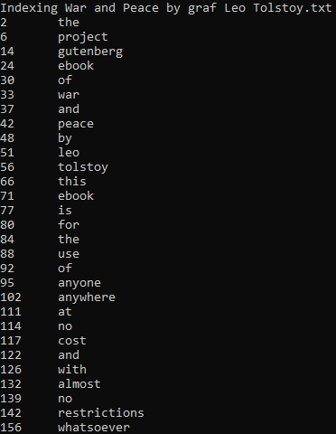
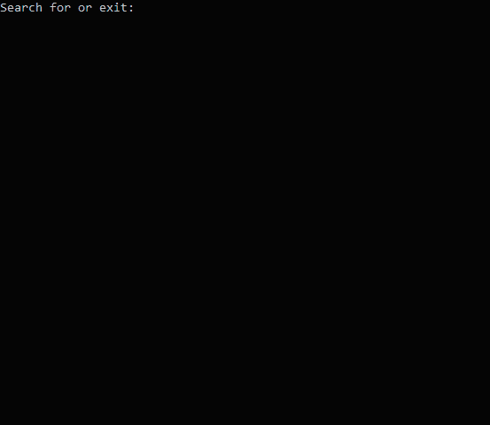
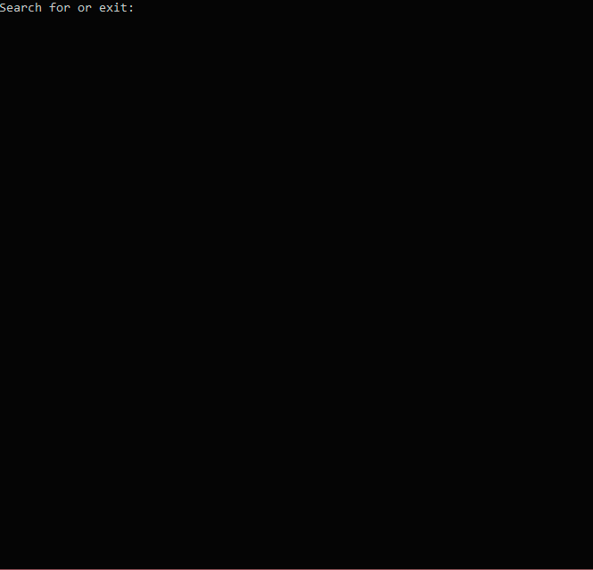

# Лабораторная работа №3: Индексированный поиск
## Описание работы
### Цели
1.  Отработать на практике реализацию эффективного алгоритма и структур данных.
### Задание
Написать программу, выполняющую поиск текста в текстовых файлах. Основное требование: поиск не должен выполняться полным перебором. Необходимо реализовать так называемый «индекс» (структуру данных для быстрого поиска) и искать по индексу. Формат индекса и способ его хранения студент выбирает самостоятельно. Допускается хранить индекс в оперативной памяти, создавая его каждый раз при запуске программы. Не допускается использование любых готовых программных библиотек по реализации индексированного поиска.

Программа должна быть реализована в виде консольного приложения, которое выполняет следующие действия:
1)	При запуске выполняет индексацию файлов в некотором каталоге.
2)	Запрашивает у пользователя строку поиска.
3)	Выводит результаты поиска по индексу.

В рамках данной работы предполагается, что индексируемые файлы это простые текстовые файлы в кодировке, определяемой студентом (ASCII, UTF8, UTF16 или любом другом). Строка поиска, вводимая пользователем, представляет собой набор слов, разделённых символами, не образующими слово (например, пробелами). Программа должна выводить время, затраченное на индексацию и поиск.

Выполнение перечисленных выше требований оценивается как «удовлетворительно». Для получения более высоких оценок необходимо дополнительно:
-   Для получения оценки «Хорошо»  выполнить все следующие требования: 
    -   Программа должна занимать менее 400 строк кода. Считаются только строки с кодом, но не с комментариями или пустые. Вычислять размер кода можно встроенным средством Visual Studio, если оно доступно.
-   Для получения оценки «Отлично» необходимо к требованиям оценки «хорошо» выполнить следующее требование:
    -   Программа должна выполнять нечёткий поиск. То есть должна находить слова, которые похожи на то, что ввёл пользователь, но не являются точно такими же. Как минимум, для этого необходимо искать без учёта регистра символов и трактовать похожие буквы как одинаковые. А именно, одинаковыми могут считаться: русская «е» и латинская «e», русская «о» и латинская «o», прочие похожие буквы разных алфавитов и цифры (полный набор заменяемых букв остаётся на усмотрение студента).
    -   Выводить фрагмент текста, в котором найдены искомые слова. Достаточно показать фрагмент текста, в котором есть хотя бы одно из искомых слов.
    -   Выполнять ранжирование результатов поиска: сортировать результаты так, чтобы первыми отображались наиболее близкие к тому, что искал пользователь. Конкретный алгоритм ранжирование остаётся на усмотрение студента.

Пример работы программы, выполненной на отлично:
-   Пользователь вводит « иван васильевич »<br>
    Система выводит:<br>
    32 ms<br>
    ivan_vas_men.txt: …мнату вошёл Иван Васильевич, сел и за…<br>
    book1.txt: … лежал ивАн на печи 3 года, да так ду …<br>

### Демонстрация работы
1.	Рассказать коротко используемые алгоритмы индексирования, поиска и ранжирования (если реализовано).
2.	Продемонстрировать поиск по файлам.
3.	Увеличить количество файлов в папке в три раза, продемонстрировать, что время поиска достаточно невысокое (не дольше секунды на десять мегабайт текста), и при этом осталось гораздо меньше времени индексации.

## Выполнение работы
### Описание алгоритмов

**Инвертированный индекс** — структура данных, в которой для каждого слова коллекции документов в соответствующем списке перечислены все документы в коллекции, в которых оно встретилось. 

Есть два варианта инвертированного индекса:

1.  индекс, содержащий только список документов для каждого слова,
2.  индекс, дополнительно включающий позицию слова в каждом документе.

Я реализовал второй вариант.

Для нечёткого поиска не будем обращать на регистр букв, а также реализуем поиск, если пользователь забыл переключить раскладку на клавиатуре.

Ранжирование результатов поиска будет происходить по количеству результатов поиска в файле.

### Описание кода
Программа состоит из двух классов
1.  FileSearch - класс объединяющий поиск по файлам в один объект.
2.  SearchResult - класс производящий поиск по одному файлу.

#### SearchResult.cs
Для начала разберём класс для поиска в одном файле.

Для хранения инвертированного индекса заведём словарь.

```C#
private Dictionary<int, string> text;
```

Метод BuildIndex() будет заполняет данный словарь.

```C#
public void BuildIndex()
{
    Console.WriteLine("Indexing " + Path.GetFileName(file));
    // Считываем из файла весь текст
    fullText = File.ReadAllText(file);
    // Строка со знаками пунктуации 
    string punctuation = "!\"#$%&'()*+,-./:;<=>?@[\\]^_`{|}~\t\r";
    string word = "";
    // Проходимся циклом по всем символам текста
    for (int i = 0; i < fullText.Length; i++)
    {
        char c = char.ToLower(fullText[i]); 
        // Отбрасываем знаки пунктуации, чтобы поиск не обращал на них внимания
        if (!punctuation.Contains(c))
        {
            // Проверка окончания слова
            if (c == ' ' || c == '\n')
            {
                if (!word.Equals(""))
                {
                    // Добавляем индекс и слово в словарь 
                    text.Add(i - word.Length, word);
                    word = "";
                }
            }
            else
            {
                word += c;
            }
        }
    }
}
```

Можем вывести начало словаря с индексами в консоль.



Метод для поиска фразы в тексте файла по инвертированному индексу.

```C#
public List<string> Find(string phrase)
{
    // Разбиваем фразу на слова, не обращаем внимания на регистр букв
    string[] words = phrase.ToLower().Split(' ');
    phraseLength = phrase.Length - words.Length + 1;
    // Создаём список, где будут хранится результаты поиска
    List<string> phrases = new List<string>();
    // Проходимся по словарю с инвертированный индексом
    int count = 0, position = 0;
    foreach (KeyValuePair<int, string> kvp in text)
    {
        position = count == 0 ? kvp.Key : position;
        // Проверки, если такое слово есть в тексте
        if (kvp.Value.Equals(words[count]))
        {
            // Проверка на то, чтобы слова из фразы находились рядом в тексте 
            if (count == words.Length - 1)
            {
                // Метод GetPhrase() возвращает строку, где находится данная фраза в тексте
                phrases.Add(GetPhrase(position));
            }
            count = count + 1 == words.Length ? 0 : count + 1;
        }
        else
        {
            count = 0;
        }
    }
    return phrases;
}
```

#### FileSearch.cs
Как уже говорилось ранее в данном классе мы объеденим результаты поиска со всех файлов.

Результаты поиска будем хранить в словаре, где сначало идёт название текстового документа, а потом найденные фразы.  

```C#
private Dictionary<string, List<string>> results;
```

В конструкторе получаем список файлов в директории и создаём столько же объектов SearchResult для хранения результатов поиска.

```C#
private string[] files;
private SearchResult[] searchResults;
        
public FileSearch(string path)
{
    files = Directory.GetFiles(path);
    searchResults = new SearchResult[files.Length];
}
```

Метод BuildIndex() вызывает соответствующий методы у каждого объекта SearchResult.

```C#
public void BuildIndex()
{
    for (int i = 0; i < searchResults.Length; i++)
    {
        searchResults[i] = new SearchResult(files[i]);
        searchResults[i].BuildIndex();
    }
}
```

Для нечёткого поиска создадим строки символов соответствующих клавишам русской и английской раскладках клавиатуры.

```C#
private string RusKey = "Ё!\"№;%:?*()_+ЙЦУКЕНГШЩЗХЪ/ФЫВАПРОЛДЖЭЯЧСМИТЬБЮ,ё1234567890-=йцукенгшщзхъ\\фывапролджэячсмитьбю. ";
private string EngKey = "~!@#$%^&*()_+QWERTYUIOP{}|ASDFGHJKL:\"ZXCVBNM<>?`1234567890-=qwertyuiop[]\\asdfghjkl;'zxcvbnm,./ ";
```

Метод Find() собирает результаты поиска по всем файлам в словарь results.

```C#
public void Find(string phrase)
{
    // Создаём новый словарь с результатами поиска
    results = new Dictionary<string, List<string>>();
    // Проходимся по всем файлам
    for (int i = 0; i < searchResults.Length; i++)
    {
        // Лист для найденных фраз для файла на i-ой итерации
        List<string> list = new List<string>();
        // Производим поиск фразы по файлу и записываем результат
        foreach (string s in searchResults[i].Find(phrase))
        {
            list.Add(s);
        }
        // Переводим поисковый запрос на другую раскладку
        string phraseRus = "";
        foreach (char c in phrase)
        {
            int index = Array.IndexOf(RusKey.ToCharArray(), c);
            if (index == -1)
            {
                break;
            }
            phraseRus += EngKey[index];
        }
        // Производим поиск фразы на другой раскладке по файлу и записываем результат
        foreach (string s in searchResults[i].Find(phraseRus))
        {
            list.Add(s);
        }
        // В финальный словарь записываем имя файла и результаты поиска по нему
        results.Add(Path.GetFileName(files[i]), list);
    }
}
```

Ранжировать результаты поиска будем по количеству совпадений при выводе.

```C#
public override string ToString()
{
    foreach (KeyValuePair<string, List<string>> kvp in results.OrderBy(x => x.Value.Count))
    {
    ...
    }
}
```

#### Program.cs
В мейне реализован таймер для индексации и поиска, а также пользовательский интерфейс.

### Демонстрация работы

1.  Программа вместе с пробелами составляет 233 строчки.
    -   SearchResult.cs - 108
    -   FileSearch.cs - 87
    -   Program.cs - 38

2.  Индексация файлов.


-   Время индексации - 8885 мс
-   Общий размер файлов - 12.7 мб

2.  Поиск по файлам.


    
3.  Нечёткий поиск с неправильной раскладкой.



4.  Индексация при большом количестве файлов.


-   Время индексации - 71199 мс
-   Общий размер файлов - 100.5 мб

5.  Поиск при большом количестве файлов.



| Размер файлов (мб)    | 12.7     | 100.5    |
| --------------------- | -------- | -------- |
| Время индексации (мс) | 8885     | 71199    |
| Время поиска (мс)     | 137      | 1056     |
