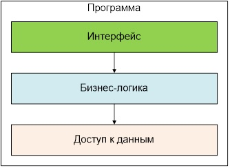

# Лабораторная работа №4: Работа с файлами, разделение приложения на уровни
## Описание работы
### Цели
1.	Отработать на практике работу с файлами широко распространённых текстовых форматов CSV и XML.
2.	Научиться создавать приложение с простейшей типовой архитектурой разделения на уровни.
### Задание
Написать консольную программу, реализующую типичную финансовую задачу: разнесения оплат по счетам. Исходные данные предоставляются в виде файлов XML и CSV, в результате работы программы должен быть сформирован XML-файл.
#### Входные данные
1.	Файл платежей формата CSV со следующими полями (поля разделены “;”, предполагается, что в полях символа “;” нет): 
    -	Название клиента (строка); 
    -	Дата платежа (в формате dd.MM.yyyy);
    -	Номер платежа (строка); 
    -	Сумма платежа (число с плавающей точкой, разделитель дробной части «.»). 

2.	Файл счетов формата XML со следующей структурой: набор документов (элемент Bills), где каждый элемент (Bill) содержит атрибуты:
    -	Название клиента (строка); 
    -	Дата счёта (в формате dd.MM.yyyy);
    -	Номер счёта (строка); 
    -	Сумма счёта (число с плавающей точкой, разделитель дробной части «.»). 
#### Выходные данные
1.  Файл формата XML со списком оплат (Payments), где каждый элемент (Payment) представляет собой запись о платеже со следующими атрибутами:
    -   Название клиента (строка); 
    -   Дата платежа (в формате dd.MM.yyyy);
    -   Номер платежа (строка); 
    -   Дата счёта (в формате dd.MM.yyyy);
    -   Номер счёта (строка); 
    -   Сумма платежа  (число с плавающей точкой, разделитель дробной части «.»).

#### Требования по формированию оплаты
Программа должна ставить в соответствие каждому счёту клиента один или более платёжный документ (относящийся к тому же клиенту) таким образом, чтобы сумма счёта максимально покрывалась платёжными документами. Каждый счёт может быть оплачен более чем одним платежом, каждый платёж может быть использован для оплаты более чем одного счёта. И платежи, и счёта должны быть упорядочены хронологически. Даты платежа и счёта при оплате сравнивать не надо (допускается, что платёж пришёл раньше счёта и наоборот).

Программа должна проверять корректность входных данных (заполнение всех полей и соответствие их значений формату) и выдавать сообщение при несоответствии (достаточно выбросить исключение). В случае любой ошибки в формате исходных данных программа должна быть остановлена.

Пример расчёта оплаты
Счета:
-	Счёт от 05.05.2016 на сумму 100
-	Счёт от 01.05.2016 на сумму 200

Платежи:
-	Платёж от 01.08.2016 на сумму 150
-	Платёж от 07.08.2016 на сумму 70

Результирующая оплата:
-	Счёт от 01.05.2016, Платёж от 01.08.2016, сумма 150
-	Счёт от 01.05.2016, Платёж от 07.08.2016, сумма 50
-   Cчёт от 05.05.2016, Платёж от 07.08.2016, сумма 20

Выполнение перечисленных выше требований оценивается как «хорошо». Для получения оценки «отлично» программа должна занимать менее 200 строк (суммарно по всем файлам). Считаются только строки с кодом, но не с комментариями или пустые. В каждой строке должно быть не более одного оператора, запрещены длинные строки кода (более 100 символов). Вычислять размер кода можно встроенным средством Visual Studio.

#### Требования по структуре программы



### Демонстрация работы
1.	Запустить программу с тестовыми файлами;
2.	Продемонстрировать файл, получившийся в результате;
3.	Изменить данные в обоих тестовых файлах;
4.	Повторно запустить программу;
5.	Продемонстрировать результирующий файл;
6.	Внести ошибку в один из файлов (например, изменив формат даты или указан неправильную дату);
7.	Запустить программу;
8.	Программа должна остановиться с выдачей ошибки. 

## Выполнение работы 
### Описание кода
Создадим 3 класса-контейнера для хранения счетов, платежей и оплат. 
В каждом классе будут необходимые поля для хранения информации из файлов, конструктор для инициализации полей и переопределённый метод ToString() для вывода информации в консоль.

#### Bill.cs
```C#
private string client;
public string Client { get { return client; } }

private DateTime date;
public DateTime Date { get { return date; } }

private string number;
public string Number { get { return number; } }

public double sum;

public Bill(string client, DateTime date, string number, double sum)
{
    this.client = client;
    this.date = date;
    this.number = number;
    this.sum = sum;
}

public override string ToString()
{
    return String.Format("{0, 15}{1, 15}{2, 15}{3, 15}",
            client, date.Date.ToShortDateString(), number, sum);
}
```

Классы PayDoc.cs и Payment.cs написаны по такому же принципу как и Bill.cs

#### PaymentRepository.cs
Класс уровня доступа к данным

1.  Чтение счетов из xml файла
```C#
public IEnumerable<Bill> GetBills()
{
    // Загружаем файл из billsPath, который задаётся в конструкторе класса
    XDocument doc = XDocument.Load(billsPath);
    foreach (XElement e in doc.Root.Nodes())
    {
        // Помещаем данные в объект Bill
        Bill bill = null;
        try
        {
            bill = new Bill(e.Attribute("Client").Value, 
                DateTime.Parse(e.Attribute("Date").Value),
                e.Attribute("Number").Value, 
                Double.Parse(e.Attribute("Sum").Value, CultureInfo.InvariantCulture));
        }
        // При ошибке в файле выводим сообщение об ошибке в консоль, и остонавливаем программу
        catch (Exception ex)
        {
            Console.WriteLine(ex.Message);
            Console.ReadKey();
            System.Environment.Exit(1);
        }
        // Возвращать будем перечисление счетов
        yield return bill;
    }
}
```
2.  Чтение платежей из csv файла

Реализован метод подобный предыдущему, только чтение файла происходит как текстовый файл
```C#
public IEnumerable<PayDoc> GetPayDocs() 
{
    string[] csv = File.ReadAllLines(payDocsPath);
    for (int i = 1; i < csv.Length; i++)
    {
        // Помещаем данные в объект PayDoc
        ...
        yield return payDoc;
    }
}
```

3.  Запись оплат в xml файл
```C#
// На входе принимаем перечисление оплат
public void SetPayDocs(IEnumerable<Payment> payments)
{
    // Создаем xml файл с заголовком Payments
    XDocument doc = new XDocument(new XElement("Payments"));
    // Добавляем оплаты в xml файл
    foreach (Payment payment in payments)
    {
        doc.Root.Add(new XElement("Payment",
            new XAttribute("Client", payment.Client),
            new XAttribute("PayDocDate", payment.PayDocDate.ToString("dd.MM.yyyy")),
            new XAttribute("PayDocNumber", payment.PayDocNumber),
            new XAttribute("BillDate", payment.BillDate.ToString("dd.MM.yyyy")),
            new XAttribute("BillNumber", payment.BillNumber),
            new XAttribute("Sum", payment.sum)));
    }
    // Сохраняем xml файл в paymentsPath, который задаётся в конструкторе класса
    doc.Save(paymentsPath);
}
```

#### PaymentLogic.cs
В данном классе реализована бизнес-логика.

В нём единственный метод, который создаёт оплаты, распределяя платежи по счетам.

```C#
public IEnumerable<Payment> GetPayments(IEnumerable<Bill> bills, IEnumerable<PayDoc> payDocs)
{
    // Создаём список счетов и сортируем его по дате
    List<Bill> billsList = new List<Bill>();
    foreach (Bill bill in bills)
    {
        billsList.Add(bill);
    }
    billsList.Sort((a, b) => a.Date.CompareTo(b.Date));
    // Создаём список платежей и сортируем его по дате
    List<PayDoc> payDocsList = new List<PayDoc>();
    foreach (PayDoc payDoc in payDocs)
    {
        payDocsList.Add(payDoc);
    }
    payDocsList.Sort((a, b) => a.Date.CompareTo(b.Date));
    // Создаём список с оплатами
    List<Payment> paymentList = new List<Payment>();
    // Проходимся по всем счетам, пока не закончились счета или платежи
    while (payDocsList.Count > 0 && billsList.Count > 0)
    {
        for (int i = 0; i < billsList.Count; i++)
        {
            // Находим индекс платежа, соответствующий i-ому счёту
            int index = payDocsList.FindIndex(x => x.Client.Equals(billsList[i].Client));
            if (index > -1)
            {
                /* Если сумма счёт больше суммы платежа, то
                    уменьшаем сумму счёта, добавляем новую оплату и удаляем платёж */
                if (billsList[i].sum > payDocsList[index].sum)
                {
                    billsList[i].sum -= payDocsList[index].sum;
                    paymentList.Add(new Payment(..., payDocsList[index].sum));
                    payDocsList.Remove(payDocsList[index]);
                }
                /* Если сумма счёт равна сумме платежа, то 
                    добавляем новую оплату, и удаляем счёт и платёж */
                else if (billsList[i].sum == payDocsList[index].sum)
                {
                    paymentList.Add(new Payment(..., billsList[i].sum));
                    billsList.Remove(billsList[i]);
                    payDocsList.Remove(payDocsList[index]);
                }
                /* Если сумма счёт меньше суммы платежа, то 
                    сохраняем оставшуюся часть платежа, добавляем новую оплату, и удаляем счёт */
                else 
                {
                    payDocsList[index].sum -= billsList[i].sum;
                    paymentList.Add(new Payment(..., billsList[i].sum));
                    billsList.Remove(billsList[i]);
                }
                break;
            }
            // Если платежа нет, то считается, что счёт не закрыт, и удаляется из списка
            else
            {
                billsList.Remove(billsList[i]);
            }
        }
    }
    // Возвращаем платежи в виде перечисления
    foreach (Payment payment in paymentList)
    {
        yield return payment;
    }
}
```

#### Program.cs
1.  Создаём PaymentRepository, считываем файлы со счетами и платежами, и выводим их в консоль
2.  Создаём PaymentLogic, расчитываем оплаты, сохраняем, и выводим их в консоль

### Демонстрация кода
1.  Запустим программу на данных из методички


В итоге получился файл

```XML
<?xml version="1.0" encoding="utf-8"?>
<Payments>
  <Payment Client="Медсервис" PayDocDate="01.02.2016" PayDocNumber="p9456" BillDate="01.03.2016" BillNumber="0312358" Sum="100.5" />
  <Payment Client="Стройдвор" PayDocDate="06.02.2016" PayDocNumber="s977" BillDate="01.02.2016" BillNumber="b-54356" Sum="40" />
  <Payment Client="Медсервис" PayDocDate="01.02.2016" PayDocNumber="p9454" BillDate="01.03.2016" BillNumber="0312358" Sum="120" />
  <Payment Client="Стройдвор" PayDocDate="06.02.2016" PayDocNumber="s977" BillDate="21.03.2016" BillNumber="b-45645" Sum="10" />
  <Payment Client="Стройдвор" PayDocDate="23.02.2016" PayDocNumber="k943" BillDate="21.03.2016" BillNumber="b-45645" Sum="30" />
  <Payment Client="Стройдвор" PayDocDate="12.04.2016" PayDocNumber="i1235" BillDate="21.03.2016" BillNumber="b-45645" Sum="60" />
  <Payment Client="Стройдвор" PayDocDate="07.07.2016" PayDocNumber="l44" BillDate="21.03.2016" BillNumber="b-45645" Sum="20" />
  <Payment Client="Стройдвор" PayDocDate="06.02.2017" PayDocNumber="o95" BillDate="21.03.2016" BillNumber="b-45645" Sum="0.5" />
  <Payment Client="Медсервис" PayDocDate="01.02.2016" PayDocNumber="p9454" BillDate="05.04.2016" BillNumber="001567" Sum="30" />
  <Payment Client="Медсервис" PayDocDate="01.02.2016" PayDocNumber="p123" BillDate="05.04.2016" BillNumber="001567" Sum="70" />
  <Payment Client="Медсервис" PayDocDate="05.04.2016" PayDocNumber="p123" BillDate="05.04.2016" BillNumber="001567" Sum="100" />
  <Payment Client="Стройдвор" PayDocDate="06.02.2017" PayDocNumber="o95" BillDate="17.04.2016" BillNumber="b-9876" Sum="5" />
  <Payment Client="Стройдвор" PayDocDate="06.02.2017" PayDocNumber="o95" BillDate="05.06.2016" BillNumber="b-3654" Sum="50" />
  <Payment Client="Медсервис" PayDocDate="05.04.2016" PayDocNumber="p123" BillDate="23.12.2016" BillNumber="053234" Sum="100" />
  <Payment Client="Медсервис" PayDocDate="01.07.2016" PayDocNumber="p9445" BillDate="23.12.2016" BillNumber="053234" Sum="30.5" />
  <Payment Client="Медсервис" PayDocDate="20.02.2017" PayDocNumber="p9455" BillDate="23.12.2016" BillNumber="053234" Sum="10" />
</Payments>
```
2.  Запуск на изменённых файлах


В итоге получился файл

```XML
<?xml version="1.0" encoding="utf-8"?>
<Payments>
  <Payment Client="Омский Газмяс" PayDocDate="01.02.2016" PayDocNumber="p9456" BillDate="23.02.2015" BillNumber="0045345" Sum="100.5" />
  <Payment Client="Омский Газмяс" PayDocDate="01.02.2016" PayDocNumber="p9454" BillDate="23.02.2015" BillNumber="0045345" Sum="150" />
  <Payment Client="Омский Газмяс" PayDocDate="05.04.2016" PayDocNumber="p123" BillDate="23.02.2015" BillNumber="0045345" Sum="2000" />
  <Payment Client="Школа" PayDocDate="20.02.2010" PayDocNumber="p9455" BillDate="01.03.2016" BillNumber="0312358" Sum="10" />
  <Payment Client="Школа" PayDocDate="12.04.2016" PayDocNumber="i1235" BillDate="01.02.2016" BillNumber="b-54356" Sum="40" />
  <Payment Client="Школа" PayDocDate="12.04.2016" PayDocNumber="i1235" BillDate="01.03.2016" BillNumber="0312358" Sum="20" />
  <Payment Client="Школа" PayDocDate="07.07.2016" PayDocNumber="l44" BillDate="01.03.2016" BillNumber="0312358" Sum="20" />
  <Payment Client="Стройдвор" PayDocDate="06.02.2016" PayDocNumber="s977" BillDate="17.04.2016" BillNumber="b-9876" Sum="5" />
  <Payment Client="Медсервис" PayDocDate="01.07.2016" PayDocNumber="p9445" BillDate="23.12.2016" BillNumber="053234" Sum="30.5" />
  <Payment Client="Стройдвор" PayDocDate="06.02.2016" PayDocNumber="s977" BillDate="05.06.2016" BillNumber="b-3654" Sum="45" />
  <Payment Client="Стройдвор" PayDocDate="23.02.2016" PayDocNumber="k943" BillDate="05.06.2016" BillNumber="b-3654" Sum="5" />
  <Payment Client="Медсервис" PayDocDate="01.02.2018" PayDocNumber="p123" BillDate="23.12.2016" BillNumber="053234" Sum="70" />
</Payments>
```

3.  Добавим ошибку в файл

Напишем вместо числовой даты слово


В таком случае программа прекращает свою работу

4.  Количество строк в программе, счёт идёт только по строкам кода
Всего получается 183 строк
-   Bill.cs - 18
-   PayDoc.cs - 18
-   Payment.cs - 27
-   PaymentRepository.cs - 52
-   PaymentLogic.cs - 41
-   Program.cs - 27

