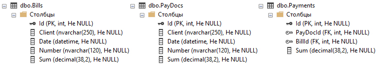
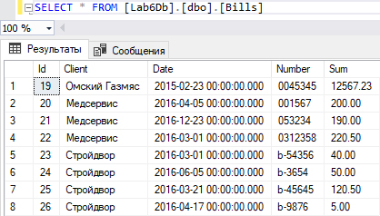
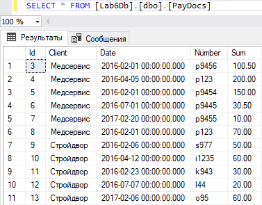
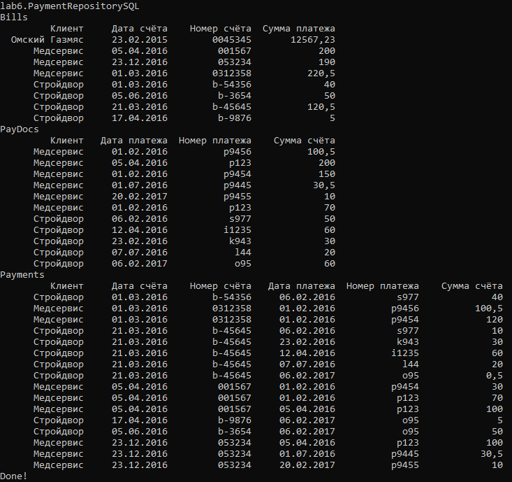
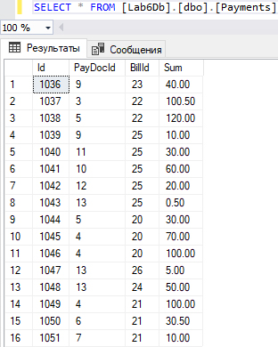

# Лабораторная работа №6: Реляционная БД
## Описание работы
### Цели
Опробовать работу с реляционной БД под управлением СУБД Microsoft SQL Server из .NET.
### Задание
Данная работа является продолжением лабораторной работы №4. 
1.	Создать БД с таблицами: счета, платежные документы, платежи.
2.	Объявить интерфейс уровня доступа к данным: интерфейс должен содержать методы из класса доступа к данным лабораторной работы №4.
3.	Сделанный в рамках лабораторной работы №4 класс работы с данными изменить так, чтобы он реализовывал интерфейс из пункта 2.
4.	Добавить в уровень доступа к данным класс работы с данными, работающий с БД. Класс должен читать счета и платёжные документы из соответствующих таблиц, и записывать платежи в таблицу платежей.
5.	В программе должен быть реализован отдельный класс-фабрика, который содержит всего один метод, возвращающий класс для работы с данными. В зависимости от настроек метод должен возвращать либо класс для работы с файлами, либо класс для работы с БД.

Выполнение перечисленных выше требований оценивается на «Хорошо». Для получения оценки «Отлично» необходимо все настройки разместить в файле конфигурации приложения (app.config). А именно, следующие настройки:
-   Имена файлов;
-   Строку подключения к СУБД;
-   Тип класса для работы с данными: файлы или СУБД.
### Демонстрация работы
Предполагается, что данные в БД точно такие же, какие в файлах для проверки лабораторной работы №4.
1.  Настроить программу на работу с файлами.
2.	Запустить программу с тестовыми файлами.
3.	Продемонстрировать файл, получившийся в результате.
4.	Изменить настройки программы на работу с БД.
5.	Запустить программу. Результат её работы в таблице БД должен в точности совпадать с результатом работы программы с файлами.

## Выполнение работы 
### Описание кода
#### IRepository.cs

Данный интерфейс задаёт уровень доступа к данным, его будут реализовывать 2 класса:
1.  PaymentRepository - класс для работы с локальными данными из лабораторной работы №4
2.  PaymentRepositorySQL - класс для работы с данными из БД, через SQL запросы

```C#
interface IRepository
{
    // Метод для чтения счетов
    IEnumerable<Bill> GetBills();
    // Метод для чтения платежей
    IEnumerable<PayDoc> GetPayDocs();
    // Метод для записи оплат
    void SetPayDocs(IEnumerable<Payment> payments);
}
```

#### RepositoryFactory.cs

Класс-фабрика, который считывает информацию из конфигурационного файла и определяет класс работы с даннами

Будем кидать исключения, если в конфиге нет требуемой информации

```C#
public static IRepository GetRepository()
{
    // Считываем конфигурационный файл
    var tp = ConfigurationManager.AppSettings;
    // Определяем в каком режиме должна работать программа
    string mode = tp["mode"].ToLower();
    if (mode == "sql")
    {
        // В SQL режиме считываем из конфига информацию о подключении к БД
        string sqlConnect = tp["sqlConnect"];
        if (sqlConnect == "" || sqlConnect == null)
        {
            throw new Exception("The sql connection info in App.config is not specified");
        }
        return new PaymentRepositorySQL(sqlConnect);
    }
    else if (mode == "local")
    {
        // В Local режиме считываем из конфига директорию нахождения файлов
        string path = tp["path"];
        if (path == "" || path == null)
        {
            throw new Exception("The path to the files in App.config is not specified");
        }
        return new PaymentRepository(path + "Bills.xml",
                path + "PayDocs.csv", path + "Payments.xml"); 
    }
    else
    {
        throw new Exception("Unknown operation mode set in App.config");
    }
}
```

#### App.config

Сам конфигурационный файл выглядит следующем образом

```XML
<?xml version="1.0" encoding="utf-8" ?>
<configuration>
    <startup> 
        <supportedRuntime version="v4.0" sku=".NETFramework,Version=v4.6" />
    </startup>
    <appSettings>
        <!-- Строка для определения режима работы программы local/sql -->
        <add key="mode" value="local"/>
        <!-- Строка для подключения к БД для режима работы с базой данных -->
        <add key="sqlConnect" value="Server=E1FOUR15F;Database=Lab6Db;Integrated Security=true"/>
        <!-- Строка для определения директории файлов для локального режима работы -->
        <add key="path" value="../../files/"/>
    </appSettings>
</configuration>
```

#### PaymentRepositorySQL.cs

Данный класс предназначен для чтения/записи файлов в БД

```C#
// Реализуем наш интерфейс
class PaymentRepositorySQL : IRepository
{
    // Строка для подключения к БД
    private string sqlConnect;

    public PaymentRepositorySQL(string sqlConnect)
    {
        this.sqlConnect = sqlConnect; 
    }
    ...
}
```

Так как методы GetBills() и GetPayDocs() практически одинаковые, и они разбирались в лабораторной работе №4, то разберём только часть с получением информации из БД.

```C#
public IEnumerable<Bill> GetBills()
{
    // Инициализирует новое подключение к БД
    using (SqlConnection cnn = new SqlConnection(sqlConnect))
    {
        // Открываем подключение к БД
        cnn.Open();
        // Создаём таблицу, где будет хранится информация полученная от БД
        DataTable bills = new DataTable();
        // Делаем SQL запрос к БД и заполняем нашу таблицу
        SqlDataAdapter adapter = new SqlDataAdapter("SELECT * FROM dbo.Bills", cnn);
        adapter.Fill(bills);
        // Проходимся по каждой строке таблицы. Дальше весь код идентичен лабораторной работе №4 
        foreach (DataRow row in bills.Rows)
        {
            ...
            yield return bill;
        }
    }
}
```

Метод для записи оплат 

```C#
public void SetPayDocs(IEnumerable<Payment> payments)
{
    // Инициализирует новое подключение к БД
    using (SqlConnection cnn = new SqlConnection(sqlConnect))
    {
        // Открываем подключение к БД
        cnn.Open();
        foreach (Payment payment in payments)
        { 
            // Создаём новый SQL запрос для записи в таблицу Payments 
            var insertBill = new SqlCommand(@"INSERT INTO dbo.Payments (PayDocId, BillId, Sum) 
                VALUES (@payDocId, @billId, @sum)", cnn);
            // Селекторами выбираем id счетов и платежей
            var BillId = new SqlCommand(@"SELECT Bills.Id FROM dbo.Bills WHERE bills.Number = '" 
                + payment.BillNumber + "'", cnn).ExecuteScalar();
            var PayDocId = new SqlCommand(@"SELECT PayDocs.Id FROM dbo.PayDocs WHERE PayDocs.Number = '"
                + payment.PayDocNumber + "'", cnn).ExecuteScalar();
            // Совмещаем все SQL команды в один запрос
            insertBill.Parameters.AddWithValue("@billId", Convert.ToInt32(BillId));
            insertBill.Parameters.AddWithValue("@payDocId", Convert.ToInt32(PayDocId));
            insertBill.Parameters.AddWithValue("@sum", payment.sum);
            // Выполняем запрос
            insertBill.ExecuteNonQuery();
        }
    }
}
```

#### Program.cs

В мейне создаётся класс-фабрика, выполняется расчёт, запись и вывод в консоль

```C#
static void Main(string[] args)
{
    IRepository repository = RepositoryFactory.GetRepository();
    Console.WriteLine(repository);
    Calculate(repository);
    Console.Read();
}

public static void Calculate(IRepository repository)
{
    // Считываем информацию о счетах и платежах
    var bills = repository.GetBills();
    var payDocs = repository.GetPayDocs();
    // Включаем бизнес-логику и расчитываем оплаты
    PaymentLogic pl = new PaymentLogic();
    var payments = pl.GetPayments(bills, payDocs);
    // Записываем оплаты 
    repository.SetPayDocs(payments);
    // Вывод в консоль
    ...
}
```

### Демонстрация работы

1.  В локальном режиме, в конфиге прописываем mode=local


Получаем файл с оплатами

```XML
<?xml version="1.0" encoding="utf-8"?>
<Payments>
    <Payment Client="Медсервис" PayDocDate="01.02.2016" PayDocNumber="p9456" BillDate="01.03.2016" BillNumber="0312358" Sum="100.5" />
    <Payment Client="Стройдвор" PayDocDate="06.02.2016" PayDocNumber="s977" BillDate="01.02.2016" BillNumber="b-54356" Sum="40" />
    <Payment Client="Медсервис" PayDocDate="01.02.2016" PayDocNumber="p9454" BillDate="01.03.2016" BillNumber="0312358" Sum="120" />
    <Payment Client="Стройдвор" PayDocDate="06.02.2016" PayDocNumber="s977" BillDate="21.03.2016" BillNumber="b-45645" Sum="10" />
    <Payment Client="Стройдвор" PayDocDate="23.02.2016" PayDocNumber="k943" BillDate="21.03.2016" BillNumber="b-45645" Sum="30" />
    <Payment Client="Стройдвор" PayDocDate="12.04.2016" PayDocNumber="i1235" BillDate="21.03.2016" BillNumber="b-45645" Sum="60" />
    <Payment Client="Стройдвор" PayDocDate="07.07.2016" PayDocNumber="l44" BillDate="21.03.2016" BillNumber="b-45645" Sum="20" />
    <Payment Client="Стройдвор" PayDocDate="06.02.2017" PayDocNumber="o95" BillDate="21.03.2016" BillNumber="b-45645" Sum="0.5" />
    <Payment Client="Медсервис" PayDocDate="01.02.2016" PayDocNumber="p9454" BillDate="05.04.2016" BillNumber="001567" Sum="30" />
    <Payment Client="Медсервис" PayDocDate="01.02.2016" PayDocNumber="p123" BillDate="05.04.2016" BillNumber="001567" Sum="70" />
    <Payment Client="Медсервис" PayDocDate="05.04.2016" PayDocNumber="p123" BillDate="05.04.2016" BillNumber="001567" Sum="100" />
    <Payment Client="Стройдвор" PayDocDate="06.02.2017" PayDocNumber="o95" BillDate="17.04.2016" BillNumber="b-9876" Sum="5" />
    <Payment Client="Стройдвор" PayDocDate="06.02.2017" PayDocNumber="o95" BillDate="05.06.2016" BillNumber="b-3654" Sum="50" />
    <Payment Client="Медсервис" PayDocDate="05.04.2016" PayDocNumber="p123" BillDate="23.12.2016" BillNumber="053234" Sum="100" />
    <Payment Client="Медсервис" PayDocDate="01.07.2016" PayDocNumber="p9445" BillDate="23.12.2016" BillNumber="053234" Sum="30.5" />
    <Payment Client="Медсервис" PayDocDate="20.02.2017" PayDocNumber="p9455" BillDate="23.12.2016" BillNumber="053234" Sum="10" />
</Payments>
```

2.  В режиме работы с БД, в конфиге прописываем mode=sql

В БД созданы исходные таблицы для счетов, платежей и оплат



Таблицы счетов и платежей заполним исходными данными




В консоле выводится точно также как и в локальном режиме, где-то строчки поменяны местами



В таблицу Payments записался результат



Результат в точности повторяет локальный режим работы