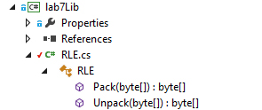

# Лабораторная работа №7: Автоматизированные тесты
## Описание работы
### Цели
Создать автоматизированные тесты (юнит-тесты) для проверки программного кода своей библиотеки.
### Задание
#### Подготовительная часть
Создать библиотеку, реализующую функционал сжатия массива байт RLE. Библиотека должна содержать следующие методы
-	byte[] Pack ( byte[] data ) – сжимает набор байт алгоритмом RLE, возвращая упакованные данные;
-	byte[] Unpack ( byte[] data ) – распаковывает набор данных.

Допускается любая реализация сжатия и распаковки, эффективность в данном случае не проверяется.
#### Основная часть задания
Написать юнит-тесты, запускаемые в Visual Studio для проверки функционала библиотеки. Набор тестов и конкретный проверяемый функционал остаётся на усмотрение студента.
Пример тестов:
-	Передать недопустимые параметры, которые программа должна уметь обрабатывать без выброса исключения. Проверить, что при этом не будет выдано исключения.
-	Передать параметры, ответ программы на которые заведомо известен. Проверить, что возвращаемый ответ равен ожидаемому.
-	Проверить корректность работы программы при специально подобранных данных. Например, передать больше 255 одинаковых символов на сжатие, и проверить, что они упаковались корректно.
-	Передать недопустимые параметры, которые программа умеет обрабатывать с выбросом исключения. Проверить, что выброшено действительно то исключение, которое ожидалось.

Необходимо разработать как минимум 5 тестов.
### Демонстрация работы
Продемонстрировать программный код библиотеки и тестов. Запустить тесты. 

## Выполнение работы
### Описание кода 

Создаём библиотеку с единственным классом для дальнейшего тестирования



#### RLE.cs

В данном классе реализован метод сжатия RLE

```C#
public static byte[] Pack(byte[] data)
{
    // Получаем исходную строку и создаём строку после паковки
    string input = Encoding.UTF8.GetString(data) + " ";
    string packData = "";
    // Счётчик количества одинаковых символов
    int count = 1;
    char current = input[0];
    // Проходимся по всей строке
    for (int i = 1; i < input.Length; i++)
    {
        // Если байт совпадает с текущим, то увеличиваем счётчик одинаковых байтов
        if (input[i] == current)
        {
            count++;
        }
        // Если не совпадает или байт предпоследний, то записываем в 
        if (input[i] != current || i + 1 == input.Length)
        {
            // Добавляем строку, сбрасываем счётчик и назначаем новый символ текущим
            packData += count.ToString() + current + " ";
            count = 1;
            current = input[i];
        }
    }
    return Encoding.UTF8.GetBytes(packData);
}
```

```C#
public static byte[] Unpack(byte[] data)
{
    // Получаем исходную строку и создаём строку с цифрами
    string input = Encoding.UTF8.GetString(data);
    string digits = "0123456789";
    // Создаём строку после распаковки и счётчик
    string unpackData = "", count = "";
    char current = '\n';
    // Проходимся по всей строке
    for (int i = 0; i < input.Length; i++)
    {
        // Если символ - цифра, то считываем её в счётчик
        if (digits.IndexOf(input[i]) != -1)
        {
            count += input[i];
        }
        // Если символ - разделитель, то добавляем в строку распаковки count символов
        else if (input[i] == ' ')
        {
            for (int j = 0; j < int.Parse(count); j++)
            {
                unpackData += current;
            }
            // Обнуляем счётчик
            count = "";
        }
        // Если символ - символ, то считаем его текущим
        else
        {
            current = input[i];
        }
    }
    return Encoding.UTF8.GetBytes(unpackData);
}
```

#### RLETests.cs

В данном тестовом классе хранятся наши юнит-тесты 

1.  Pack_Sample - тестирование паковки программы на известном ответе

```C#
// Указываем, что данный метод тестовый
[TestMethod]
public void Pack_Sample()
{
    // Создаём массив байт по тестовой строке
    byte[] packData = Encoding.UTF8.GetBytes("SSSSSJJJJJDDDUUWBBSSSSSSS>>>>>>>>");
    // Ожидаем, что после паковки будет такой массив байт
    byte[] expectedData = Encoding.UTF8.GetBytes("5S 5J 3D 2U 1W 2B 7S 8> ");
    // Получаем реальный результат паковки тестовой строки
    byte[] actualData = RLE.Pack(packData);
    // Поэлементно сравниваем реальный и ожидаемый массивы
    for (int i = 0; i < actualData.Length; i++)
    {
        Assert.AreEqual(expectedData[i], actualData[i]);
    }
}
```

2.  Unpack_Sample - тестирование распаковки программы на известном ответе

```C#
[TestMethod]
public void Unpack_Sample()
{
    // Создаём массив байт по тестовой строке
    byte[] unpackData = Encoding.UTF8.GetBytes("12W 1B 12W 3B 24W 1B 14W ");
    // Ожидаем, что после распаковки будет такой массив байт
    byte[] expectedData = Encoding.UTF8.GetBytes("WWWWWWWWWWWWBWWWWWWWWWWWWBBBWWWWWWWWWWWWWWWWWWWWWWWWBWWWWWWWWWWWWWW");
    // Получаем реальный результат распаковки тестовой строки
    byte[] actualData = RLE.Unpack(unpackData);
    // Поэлементно сравниваем реальный и ожидаемый массивы
    for (int i = 0; i < actualData.Length; i++)
    { 
        Assert.AreEqual(expectedData[i], actualData[i]);
    }
}
```

3.  Pack_Over255chars - тестирование паковки большого количества одинаковых символов

```C#
[TestMethod]
public void Pack_Over255chars()
{
    // Создаём тестовую строку с повторяющимися символами
    string data = "";
    for (int i = 0; i < 280; i++)
    {
        data += "A";
    }
    // Создаём массив байт по тестовой строке
    byte[] packData = Encoding.UTF8.GetBytes(data);
    // Ожидаем, что после паковки будет такой массив байт
    byte[] expectedData = Encoding.UTF8.GetBytes("280A ");
    // Получаем реальный результат паковки тестовой строки
    byte[] actualData = RLE.Pack(packData);
    // Поэлементно сравниваем реальный и ожидаемый массивы
    for (int i = 0; i < actualData.Length; i++)
    {
        Assert.AreEqual(expectedData[i], actualData[i]);
    }
}
```

4.  Unpack_Over255chars - тестирование распаковки большого количества одинаковых символов

```C#
[TestMethod]
public void Unpack_Over255chars()
{
    // Создаём массив байт по тестовой строке
    byte[] unpackData = Encoding.UTF8.GetBytes("1540A ");
    // Создаём ожидаемую строку с повторяющимися символами
    string data = "";
    for (int i = 0; i < 1540; i++)
    {
        data += "A";
    }
    // Ожидаем, что после распаковки будет такой массив байт
    byte[] expectedData = Encoding.UTF8.GetBytes(data);
    // Получаем реальный результат распаковки тестовой строки
    byte[] actualData = RLE.Unpack(unpackData);
    // Поэлементно сравниваем реальный и ожидаемый массивы
    for (int i = 0; i < actualData.Length; i++)
    {
        Assert.AreEqual(expectedData[i], actualData[i]);
    }
}
```

5.  Unpack_FormatException - тестирование, что программа кидает ошибку на неправильно заданную строку при распаковке

```C#
[TestMethod]
// Ожидаем, что выдаст ошибку строки
[ExpectedException(typeof(System.FormatException))]
public void Unpack_FormatException()
{
    // Создаём массив байт и передаём в RLE функцию распаковки
    byte[] unpackData = Encoding.UTF8.GetBytes("    ");
    RLE.Unpack(unpackData);
}
```

#### Результаты юнит-тестов

