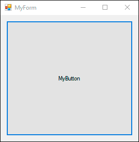

# Лабораторная работа №8: Элемент управления
## Описание работы
### Цели
Создать визуальный элемент управления Windows Forms.
### Задание
Создать элемент управления в виде кнопки, которая меняет свой цвет и инициирует событие Centered при наведении указателя мыши в центр.  Событие должен создать студент, параметры в событие передавать не надо. Радиус окружности вокруг центра кнопки, при наведении на которую должно инициироваться событие Centered и меняться цвет, должен задаваться свойством Radius (измеряется в пикселях). 

Элемент управления надо создать в отдельной сборке. Необходимо поместить разработанный элемент управления на панель элементов управления, после чего перенести его на форму.

Добавить на форму обработчик события Centered, который будет выдавать стандартное диалоговое окно с сообщением.

### Демонстрация работы
На форме поместить указатель мыши в центр кнопки, она должна изменить свой цвет, и должно появиться диалоговое окно с сообщением "Centered!".

## Выполнение работы 
### Описание кода
#### MyButton.cs

Создаём кнопку в отдельной сборке


```C#
// Наследуем нашу кнопку от стандартного класса Button
public class MyButton : Button
{
    // Свойство для задачи радиуса окружности
    public int Radius { get; set; }
    // Инициализируем событие Centered
    public event MouseEventHandler Centered;
    // Переписываем событие OnMouseMove, чтобы знать координаты курсора
    protected override void OnMouseMove(MouseEventArgs e)
    {
        // Обозначаем активную область центра - окружность
        if (Math.Sqrt(Math.Pow((e.X - Width / 2), 2) + Math.Pow((e.Y - Height / 2), 2)) <= Radius)
        {
            // Меняем цвет кнопке 
            BackColor = Color.Cyan;
            // Говорим, что наше событие сработало
            Centered(this, e);
        }
    }
}
```

#### MyForm.cs

Добавляем наш компонент на форму и настраиваем его 


В свойствах компонента находим наше событие и выставляем ему обработчик


Также зададим кнопке свойство Radius


В нашем классе появился обработчик события

Сделаем, чтобы при срабатывании выводилось стандартное диалоговое окно с сообщением "Centered!"

```C#
public partial class MyForm : Form
{
    ...

    private void myButton_Centered(object sender, MouseEventArgs e)
    {
        MessageBox.Show("Centered!");
    }
}
```

#### Program.cs

В мейне вызовем нашу форму

```C#
Application.Run(new MyForm());
```

### Демонстрация работы

1.  С радиусом 50




2.  С радиусом 150


3.  С радиусом 5

